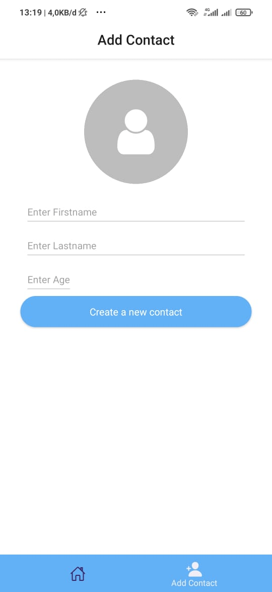

# Getting Started with React Native

I am using Expo Go (playstore app) to run this App 

Here is the full documentation
``` 
https://docs.expo.io/bare/using-expo-client/
``` 
## Preview - 



## Dependencies
- React Native
- React Native Elements for UI Elements
- NativeBase for UI Elements
- Redux for State Management
- Redux Thunk
- React Navigation
- Axios

How to run this project :

1. Clone this repo via terminal / download zip file

``` 
$ git clone git@github.com:Dhimassudaryanta/rn-contact-saver.git

$ cd rn-contact-saver

$ npm install
```

2. To start the app, you can run:

```
$ npm start
```

Let me know if you have trouble : dhimassudaryanta@gmail.com
